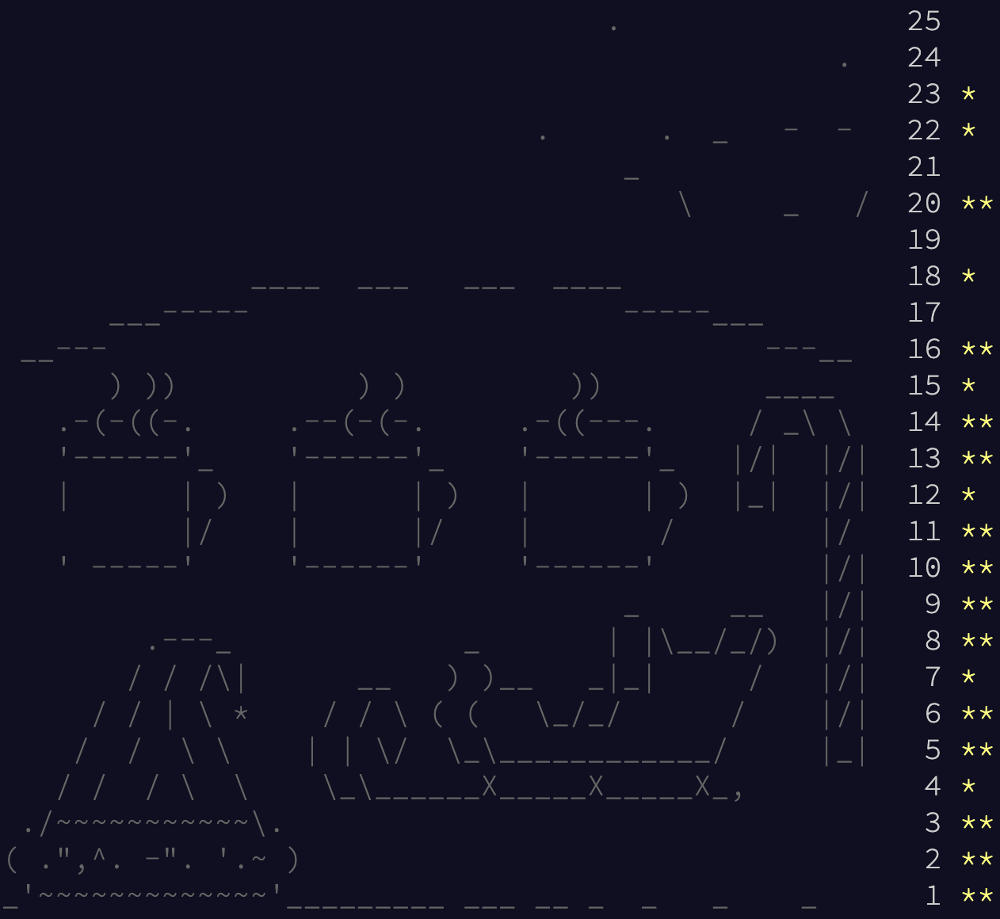

# AoC 2018

* [adventofcode.com/2018](https://adventofcode.com/2018)

* [**Day 23** - Nanobots](2018-12-23_nanobots)
* [**Day 22** - Mode Maze](2018-12-22_mode_maze)
* [**Day 20** - A Regular Map](2018-12-20_a_regular_map)
* [**Day 18** - Trees and Lumberyards](2018-12-18_trees_lumberyards)
* [**Day 16** - Instruction Registers](2018-12-16_instruction_registers_abridged)
* [**Day 15** - Beverage Bandits](2018-12-15_beverage_bandits)
* [**Day 14** - Chocolate Charts](2018-12-14_chocolate_charts)
* [**Day 13** - Mine Cart Madness](2018-12-13_mine_cart_madness)
* [**Day 12** - Subterranean Sustainability](2018-12-12_subterranean_sustainability)
* [**Day 11** - Chronal Charge](2018-12-11_chronal_charge)
* [**Day 10** - The Stars Align](2018-12-10_the_stars_align)
* [**Dau 9** - Marble Mania](2018-12-09_marble_mania)
* [**Day 8** - Memory Maneuver](2018-12-08_memory_maneuver)
* [**Day 7** - Parts Build Order](2018-12-07_parts_build_order)
* [**Day 6** - Manhattan Distance](2018-12-06_manhattan_distance)
* [**Day 5** - Alchemical Reduction](2018-12-05_alchemical_reduction)
* [**Day 4** - Sleep Intervals](2018-12-04_sleep_intervals)
* [**Day 3** - Overalpping Claims](2018-12-03_overlapping_claims)
* [**Day 2** - Inventory Management](2018-12-02_inventory_management)
* [**Day 1** - Chronal Calibration](2018-12-01_chronal_calibration)