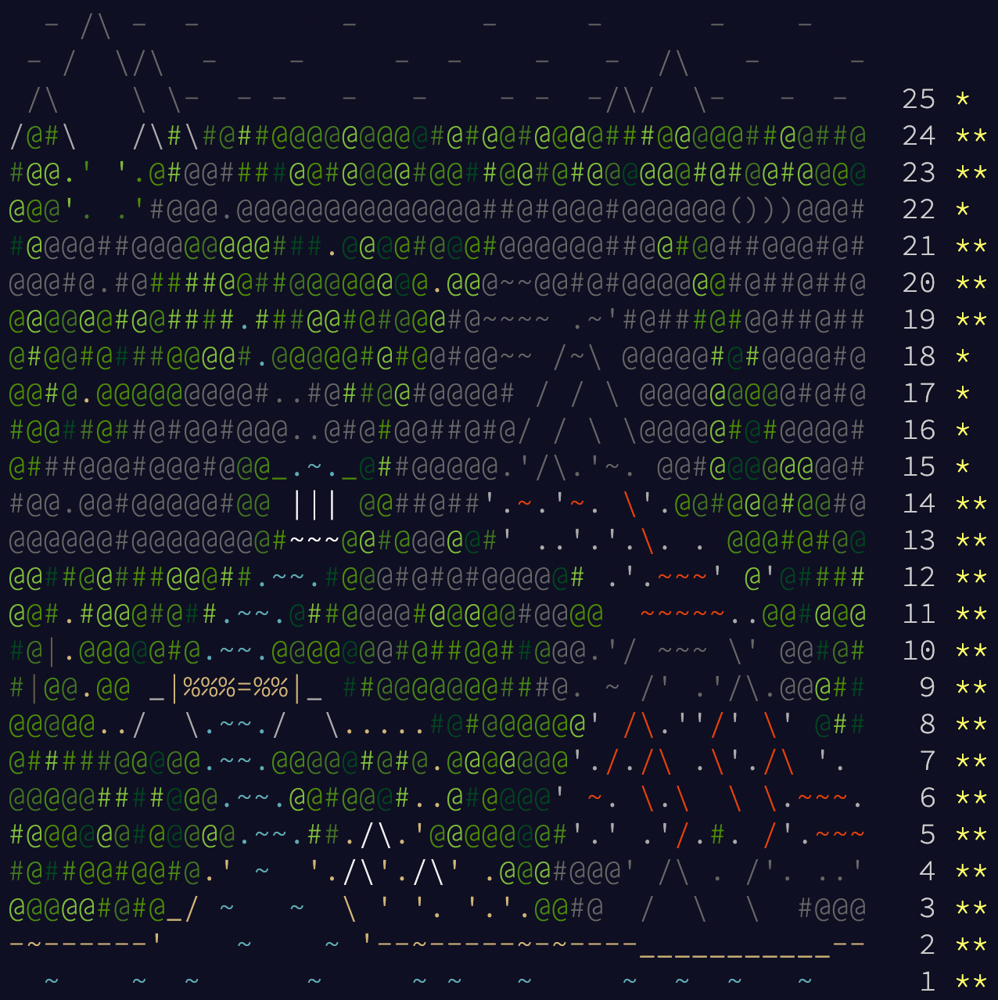

# AoC 2022
* [adventofcode.com/2022](https://adventofcode.com/2022)



---
## [Day 1: Calorie Counting](https://adventofcode.com/2022/day/1)
```python
A = []
with open('input.txt') as input:
    t = 0
    for line in input:
        line = line.strip()
        if len(line):
            t += int(line)
        else:
            A.append(t); t = 0
A.sort()
print(f'part 1: {A[-1]}')
print(f'part 2: {sum(A[-3:])}')
# part 1: 69883
# part 2: 207576
```

---
## [Day 2: Rock Paper Scissors](https://adventofcode.com/2022/day/2)
```python
cost = {
    'X': 1, 'lose': 0,
    'Y': 2, 'tie': 3,
    'Z': 3, 'win': 6,
}
m = {
    # lose
    'BX': cost['lose'] + cost['X'],
    'CY': cost['lose'] + cost['Y'],
    'AZ': cost['lose'] + cost['Z'],
    # tie
    'AX': cost['tie'] + cost['X'],
    'BY': cost['tie'] + cost['Y'],
    'CZ': cost['tie'] + cost['Z'],
    # win
    'CX': cost['win'] + cost['X'],
    'AY': cost['win'] + cost['Y'],
    'BZ': cost['win'] + cost['Z'],
}
lose = {
    'A': 'Z',
    'B': 'X',
    'C': 'Y',
}
tie = {
    'A': 'X',
    'B': 'Y',
    'C': 'Z',
}
win = {
    'A': 'Y',
    'B': 'Z',
    'C': 'X',
}

t1, t2 = 0, 0
with open('input.txt') as input:
    for line in input:
        play = ''.join(line.strip().split(' '))
        t1 += m[play]
        a, b = list(play)
        if b == 'X': t2 += cost['lose'] + cost[lose[a]]
        if b == 'Y': t2 += cost['tie'] + cost[tie[a]]
        if b == 'Z': t2 += cost['win'] + cost[win[a]]
print(f'part 1: {t1}')
print(f'part 2: {t2}')
# part 1: 12855
# part 2: 13726
```

---
## [Day 3: Rucksack Reorganization](https://adventofcode.com/2022/day/3)
```python
lower = lambda c: ord(c) - ord('a')
upper = lambda c: ord(c) - ord('A') + 26
cost = lambda c: 1 + (lower(c) if c.islower() else upper(c))

t1, t2 = 0, 0
with open('input.txt') as input:
    A = []
    for line in input:
        line = line.strip()
        n = len(line)
        a = set(list(line[:n // 2]))
        b = set(list(line[n // 2:]))
        same = a & b
        t1 += sum(cost(c) for c in same)
        A.append(a | b)
        if not (len(A) % 3):
            a, b, c = A; A = []
            same = a & b & c
            t2 += sum(cost(c) for c in same)
print(f'part 1: {t1}')
print(f'part 2: {t2}')
# part 1: 7674
# part 2: 2805
```

---
## [Day 4: Camp Cleanup](https://adventofcode.com/2022/day/4)
```python
t1, t2 = 0, 0
with open('input.txt') as input:
    for line in input:
        line = line.strip()
        A, B = line.split(',')
        i, j = [int(x) for x in A.split('-')]
        u, v = [int(x) for x in B.split('-')]
        t1 += (i <= u and v <= j) or (u <= i and j <= v)
        t2 += not (j < u) and not (v < i) # ⭐️ inversion: p is true if not p is impossible, ie. if i..j is not before inclusive-or not after u..v, then i..j and u..v must overlap
print(f'part 1: {t1}')
print(f'part 2: {t2}')
# part 1: 459
# part 2: 779
```

---
## [Day 5: Supply Stacks](https://adventofcode.com/2022/day/5)
```python
from collections import deque

def move(isStack):
    A = [
        [],                                       # 0
        ['N', 'B', 'D', 'T', 'V', 'G', 'Z', 'J'], # 1
        ['S', 'R', 'M', 'D', 'W', 'P', 'F'],      # 2
        ['V', 'C', 'R', 'S', 'Z'],                # 3
        ['R', 'T', 'J', 'Z', 'P', 'H', 'G'],      # 4
        ['T', 'C', 'J', 'N', 'D', 'Z', 'Q', 'F'], # 5
        ['N', 'V', 'P', 'W', 'G', 'S', 'F', 'M'], # 6
        ['G', 'C', 'V', 'B', 'P', 'Q'],           # 7
        ['Z', 'B', 'P', 'N'],                     # 8
        ['W', 'P', 'J'],                          # 9
    ]
    with open('input.txt') as input:
        for line in input:
            _, i, _, j, _, k = line.strip().split(' ')
            i, j, k = [int(x) for x in [i, j, k]]
            take = []
            for _ in range(i):
                take.append(A[j].pop())
            A[k].extend(take if isStack else take[::-1])
    return ''.join([row[-1] for row in A if len(row)])

print(f'part 1: {move(True)}')
print(f'part 2: {move(False)}')
# part 1: GFTNRBZPF
# part 2: VRQWPDSGP
```

---
## [Day 6: Tuning Trouble](https://adventofcode.com/2022/day/6)
```python
from collections import deque

PACKET_LEN = 4
MESSAGE_LEN = 14

part1, part2 = 0, 0
with open('input.txt') as input:
    i, P, M = 0, deque([]), deque([])
    while c:= input.read(1):
        P.append(c); M.append(c); i += 1
        if not (len(P) % PACKET_LEN):
            if not part1 and len(P) == len(set(P)): part1 = i
            P.popleft()
        if not (len(M) % MESSAGE_LEN):
            if not part2 and len(M) == len(set(M)): part2 = i
            M.popleft()
print(f'part 1: {part1}')
print(f'part 2: {part2}')
# part 1: 1155
# part 2: 2789
```

---
## [Day 7: No Space Left On Device](https://adventofcode.com/2022/day/7)
```python
from bisect import bisect_left

class Node:
    def __init__(self, parent = None):
        self.size = 0
        self.kids = {}
        self.parent = parent

root = Node()
node = root
with open('input.txt') as input:
    for line in input:
        A = line.strip().split(' ')
        if A[1] == 'cd':
            f = A[2]
            if f == '/': node = root
            elif f == '..': node = node.parent
            else:
                if f not in node.kids:
                    node.kids[f] = Node(node)
                node = node.kids[f]
        elif A[0].isdigit():
            node.size += int(A[0])

class Accumulator:
    def __init__(self):
        self.part1 = 0
        self.A = []
        self.go()
        self.part2 = self.delete()
    def go(self, node = root):
        for kid in node.kids.values():
            node.size += self.go(kid)
        if node.size <= 1e5:
            self.part1 += node.size  # part 1: accumulate total of all folders of size <= 1e5
        self.A.append(node.size)     # part 2: append candidate node size to array
        return node.size
    def delete(self):
        self.A.sort()
        space = 7e7 - self.A[-1]
        target = 3e7 - space
        i = bisect_left(self.A, target)
        return self.A[i]

acc = Accumulator()
print(f'part 1: {acc.part1}')
print(f'part 2: {acc.part2}')
# part 1: 1391690
# part 2: 5469168
```

---
## [Day 8: Treetop Tree House](https://adventofcode.com/2022/day/8)
```python
A = []
with open('input.txt') as input:
    for line in input:
        A.append([int(x) for x in line.strip()])
M, N = len(A), len(A[0])

#
# part 1
#
seen, key = set(), lambda i, j: f'{i},{j}'
for i in range(M):
    l, r = -1, -1 # left/right
    for j in range(N):
        k = N - 1 - j
        if l < A[i][j]: l = A[i][j]; seen.add(key(i, j))
        if r < A[i][k]: r = A[i][k]; seen.add(key(i, k))
for j in range(N):
    u, d = -1, -1 # up/down
    for i in range(M):
        k = M - 1 - i
        if u < A[i][j]: u = A[i][j]; seen.add(key(i, j))
        if d < A[k][j]: d = A[k][j]; seen.add(key(k, j))

#
# part 2
#
best = 0
for i in range(1, M - 1):
    for j in range(1, N - 1):
        l, k = 0, j - 1 # left
        while 0 <= k:
            l += 1
            if A[i][j] <= A[i][k]: break
            k -= 1
        r, k = 0, j + 1 # right
        while k < N:
            r += 1
            if A[i][j] <= A[i][k]: break
            k += 1
        u, k = 0, i - 1 # up
        while 0 <= k:
            u += 1
            if A[i][j] <= A[k][j]: break
            k -= 1
        d, k = 0, i + 1 # down
        while k < M:
            d += 1
            if A[i][j] <= A[k][j]: break
            k += 1
        cand = l * r * u * d
        best = max(best, cand)

print(f'part 1: {len(seen)}')
print(f'part 2: {best}')
# part 1: 1681
# part 2: 201684
```

---
## [Day 9: Rope Bridge](https://adventofcode.com/2022/day/9)
```python
def run(T):
    A, seen = [[0, 0]], set()
    with open('input.txt') as input:
        for line in input:
            d, steps = line.strip().split(' ')
            di = -1 if d == 'U' else 1 if d == 'D' else 0
            dj = -1 if d == 'L' else 1 if d == 'R' else 0
            for _ in range(int(steps)):
                slide(A, di, dj)
                if len(A) < T and A[-1] != [0, 0]:
                    A.append([0, 0])
                if len(A) == T:
                    seen.add((A[-1][0], A[-1][1]))
    return len(seen)

def slide(A, di, dj):
    i, j = A[0]; A[0] = [i + di, j + dj]
    for k in range(1, len(A)):
        i, j = A[k - 1]
        u, v = A[k]
        du = i - u
        dv = j - v
        if abs(du) == 2 or abs(dv) == 2:
            du = 1 if du == 2 else -1 if du == -2 else du
            dv = 1 if dv == 2 else -1 if dv == -2 else dv
            A[k] = [u + du, v + dv]

print(f'part 1: {run(2)}')
print(f'part 2: {run(10)}')
# part 1: 5883
# part 2: 2367
```

---
## [Day 10: Cathode-Ray Tube](https://adventofcode.com/2022/day/10)
```python
from collections import defaultdict

A = [0]
with open('input.txt') as input:
    for line in input:
        words = line.strip().split(' ')
        A.append(0 if len(words) == 1 else int(words[1]))

m, k = defaultdict(int), 0 # k-th cycle
for x in A:
    k += 1 if not x else 2
    m[k] = x

x = 1
t, take, msg = 0, set([20, 60, 100, 140, 180, 220]), [[]]
for i in range(1, k):
    x += m[i]
    t += i * x if i in take else 0
    msg[-1].append('#' if abs(x - len(msg[-1])) <= 1 else '.')
    if not (i % 40):
        msg.append([])

newline = '\n'
print(f'part 1: {t}')
print(f'part 2:\n{newline.join("".join(row) for row in msg)}')
# part 1: 15260
# part 2:
###...##..#..#.####..##..#....#..#..##..
#..#.#..#.#..#.#....#..#.#....#..#.#..#.
#..#.#....####.###..#....#....#..#.#....
###..#.##.#..#.#....#.##.#....#..#.#.##.
#....#..#.#..#.#....#..#.#....#..#.#..#.
#.....###.#..#.#.....###.####..##...###.
```

---
## [Day 11: Monkey in the Middle](https://adventofcode.com/2022/day/11)
```python
from collections import deque
import heapq

QUEUES = [
    [98, 70, 75, 80, 84, 89, 55, 98], # 0
    [59],                             # 1
    [77, 95, 54, 65, 89],             # 2
    [71, 64, 75],                     # 3
    [74, 55, 87, 98],                 # 4
    [90, 98, 85, 52, 91, 60],         # 5
    [99, 51],                         # 6
    [98, 94, 59, 76, 51, 65, 75],     # 7
]
A, isDiv3, MOD = [], False, 1

class Monkey:
    def __init__(self, index, fun, target, truthy, falsey):
        self.index = index
        self.fun = fun
        self.target = target
        self.truthy = truthy
        self.falsey = falsey
        self.cnt = 0
    def inspect(self):
        self.cnt += len(A[self.index])
        while len(A[self.index]):
            x = A[self.index].popleft()
            x = self.fun(x)
            x = x // 3 if isDiv3 else x % MOD
            if not (x % self.target):
                A[self.truthy].append(x)
            else:
                A[self.falsey].append(x)

monkeys = [
    Monkey(0, lambda x: x * 2, 11, 1, 4),
    Monkey(1, lambda x: x * x, 19, 7, 3),
    Monkey(2, lambda x: x + 6, 7, 0, 5),
    Monkey(3, lambda x: x + 2, 17, 6, 2),
    Monkey(4, lambda x: x * 11, 3, 1, 7),
    Monkey(5, lambda x: x + 7, 5, 0, 4),
    Monkey(6, lambda x: x + 1, 13, 5, 2),
    Monkey(7, lambda x: x + 5, 2, 3, 6),
]

#
# part 1
#
A, isDiv3, rounds = [deque(q[:]) for q in QUEUES], True, 20
[[monkey.inspect() for monkey in monkeys] for _ in range(rounds)]
a, b = heapq.nlargest(2, [monkey.cnt for monkey in monkeys])
print(f'part 1: {a * b}')

#
# part 2
#
for monkey in monkeys:
    monkey.cnt = 0        # reset counts from part 1
    MOD *= monkey.target  # use rule-of-product to keep worry levels manageable
A, isDiv3, rounds = [deque(q[:]) for q in QUEUES], False, 10000
[[monkey.inspect() for monkey in monkeys] for _ in range(rounds)]
a, b = heapq.nlargest(2, [monkey.cnt for monkey in monkeys])
print(f'part 2: {a * b}')

# part 1: 54253
# part 2: 13119526120
```

---
## [Day 12: Hill Climbing Algorithm](https://adventofcode.com/2022/day/12)
```python
from collections import deque

A = []
with open('input.txt') as input:
    A = [list(line.strip()) for line in input]

beg, end, alt = deque(), deque(), []
M, N = len(A), len(A[0])
for i in range(M):
    for j in range(N):
        if A[i][j] == 'S': beg.append((i, j)); A[i][j] = 'a'
        if A[i][j] == 'E': end.append((i, j)); A[i][j] = 'z'
        if A[i][j] == 'a': alt.append(deque([(i, j)]))

def bfs(start):
    q, seen, depth = start, set(start), 0
    while q:
        for _ in range(len(q)):
            i, j = q.popleft()
            if (i, j) in end:
                return depth
            for u, v in [[i - 1, j], [i, j + 1], [i + 1, j], [i, j - 1]]:
                if 0 <= u < M and 0 <= v < N and ord(A[u][v]) <= ord(A[i][j]) + 1 and (u, v) not in seen:
                    q.append((u, v)); seen.add((u, v))
        depth += 1
    return float('inf')

print(f'part 1: {bfs(beg)}')
print(f'part 2: {min([bfs(cand) for cand in alt])}') # alternative candidates for optimal begin
# part 1: 370
# part 2: 363
```

## [Day 13: Distress Signal](https://adventofcode.com/2022/day/13)
```python
import json

def part1():
    with open('input.txt') as input:
        i, t = 1, 0
        L, R = None, None
        for line in input:
            line = line.strip()
            if line == "":
                L, R = None, None
            elif L == None: L = json.loads(line)
            elif R == None: R = json.loads(line)
            if L != None and R != None:
                if ok(L, R):
                    t += i
                i += 1
        return t

def part2():
    with open('input.txt') as input:
        A = [json.loads(line.strip()) for line in input.readlines() if len(line.strip())] + [[[2]]] + [[[6]]]
        quickSort(A, 0, len(A) - 1, ok)
        a = 1 + A.index([[2]])
        b = 1 + A.index([[6]])
        return a * b

def ok(L, R):
    A = [(L, R, 0)]
    while A:
        L, R, i = A.pop()
        if type(L) == int and type(R) == int:
            if R < L: return False
            if L < R: return True
        elif type(L) == list and type(R) == int: A.append((L, [R], 0))
        elif type(L) == int and type(R) == list: A.append(([L], R, 0))
        elif type(L) == list and type(R) == list:
            if i < len(L) and len(R) <= i:
                return False
            elif len(L) <= i and len(R) <= i:
                continue
            elif len(L) <= i:
                return True
            A.append((L, R, i + 1))
            A.append((L[i], R[i], 0))
    return True

# https://www.geeksforgeeks.org/quicksort-using-random-pivoting/
def quickSort(array, i, j, cmp):
    def partition(A, lo, hi, cmp):
        i, pivot = lo - 1, A[hi]
        for j in range(lo, hi):
            if cmp(A[j], pivot):
                i += 1
                A[i], A[j] = A[j], A[i]
        A[i + 1], A[hi] = A[hi], A[i + 1]
        return i + 1
    A = [(i, j)]
    while A:
        i, j = A.pop()
        if j <= i:
            continue
        k = partition(array, i, j, cmp)
        A.append((i, k - 1))
        A.append((k + 1, j))

print(f'Part 1: {part1()}')
print(f'Part 2: {part2()}')
# Problem 1: 6046
# Problem 2: 21423
```

## [Day 14: Regolith Reservoir](https://adventofcode.com/2022/day/14)
```python
seen = set()
with open('input.txt') as input:
    for line in input:
        P = [[int(x) for x in pair.split(',')][::-1] for pair in line.strip().split(' -> ')]
        for k in range(1, len(P)):
            i, j = P[k - 1]
            u, v = P[k]
            di = 1 if i < u else -1 if u < i else 0
            dj = 1 if j < v else -1 if v < j else 0
            seen.add((i, j))
            while not (i == u and j == v):
                i += di
                j += dj
                seen.add((i, j))
rock = len(seen)
last = max(i for i, _ in seen)

def drop(end, limit, start = (0, 500)):
    i, j = start
    next = lambda i, j: [(i + 1, j), (i + 1, j - 1), (i + 1, j + 1)]
    D, L, R = next(i, j)
    while i < end and not (D in seen and L in seen and R in seen):
        if D not in seen: i += 1
        elif L not in seen: i += 1; j -= 1
        elif R not in seen: i += 1; j += 1
        D, L, R = next(i, j)
    if (i < end and not limit) or (limit and start not in seen):
        seen.add((i, j))
        return True
    return False

def run(end, limit):
    while drop(end, limit):
        pass
    return len(seen) - rock

print(f'part 1: {run(last, False)}')
print(f'part 2: {run(last + 1, True)}')
# part 1: 625
# part 2: 25193
```

## [Day 15: Beacon Exclusion Zone](https://adventofcode.com/2022/day/15)
```python
from collections import deque

sensors, beacons, seen = set(), set(), set()
def bfs(i, j, dist, T = int(2e6)):
    take = abs(T - i)
    if dist < take:
        return
    for k in range(take, dist + 1):
        for u, v in [(T, j + k - take), (T, j - k + take)]:
            if (u, v) not in beacons:
                seen.add((u, v))

with open('input.txt') as input:
    for k, line in enumerate(input):
        A = line.strip().split(' ')
        S = f'{A[2]}{A[3][:-1]}'
        B = f'{A[8]}{A[9]}'
        j, i = [int(word.split('=')[1]) for word in S.split(',')]; sensors.add((i, j))
        v, u = [int(word.split('=')[1]) for word in B.split(',')]; beacons.add((u, v))
        dist = abs(i - u) + abs(j - v)
        bfs(i, j, dist)
print(f'part 1: {len(seen)}')
# part 1: 5166077
```

## [Day 16: Proboscidea Volcanium](https://adventofcode.com/2022/day/16)
```python
from collections import defaultdict

adj, flow = defaultdict(set), defaultdict(int)
with open('input.txt') as input:
    for line in input:
        A = line.strip().split(' ')
        u, w = A[1], int(A[4].split('=')[1][:-1])
        flow[u] = w
        for v in ''.join(A[9:]).split(','):
            adj[u].add(v)
            adj[v].add(u)

best, T = 0, 30
q, seen = [(1, 'AA', 0, ('ZZZ',))], {}
while len(q):
    time, u, score, opened = q.pop()
    open = set([x for x in opened])
    if (time, u) in seen and score <= seen[(time, u)]:
        continue
    seen[(time, u)] = score
    if time == T:
        best = max(best, score)
        continue
    # ✅ include u
    if 0 < flow[u] and u not in open:
        open.add(u)
        new_score = score + sum(flow[x] for x in open)
        new_state = (time + 1, u, new_score, tuple(open))
        q.append(new_state)
        open.discard(u)
    # 🚫 exclude u
    new_score = score + sum(flow[x] for x in open)
    for v in adj[u]:
        new_state = (time + 1, v, new_score, tuple(open))
        q.append(new_state)

print(f'part 1: {best}')
# part 1: 1651
```

## [Day 17: Pyroclastic Flow](https://adventofcode.com/2022/day/17)
```python
class Rock:
    def __init__(self, have):
        self.point = (0, 0) # bottom-left point
        self.have = have    # set of rock points relative to self.point

class Chamber:
    def __init__(self):
        self.hi = -1
        self.start = 2
        self.rocks = [
            #    ####
            Rock(set([(0, 0), (0, 1), (0, 2), (0, 3)])),
            #    .#.
            #    ###
            #    .#.
            Rock(set([(0, 1), (1, 0), (1, 1), (1, 2), (2, 1)])),
            #    ..#
            #    ..#
            #    ###
            Rock(set([(0, 0), (0, 1), (0, 2), (1, 2), (2, 2)])),
            #    #
            #    #
            #    #
            #    #
            Rock(set([(0, 0), (1, 0), (2, 0), (3, 0)])),
            #    ##
            #    ##
            Rock(set([(0, 0), (0, 1), (1, 0), (1, 1)]))
        ]
        self.blows = []
        with open('input.txt') as input:
            for line in input:
                self.blows = [-1 if c == '<' else 1 for c in list(line.strip())]
        self.i = 0 # i-th rock
        self.k = 0 # k-th blow
        self.seen = set()

    def dropRock(self):
        rock = self.nextRock()
        while True:
            self.blow(rock)
            if not self.fall(rock): break
        self.mark(rock)

    def nextRock(self):
        rock = self.rocks[self.i]; self.i = (self.i + 1) % len(self.rocks) # i-th rock
        rock.point = (self.hi + 1 + 3, self.start)
        return rock

    def blow(self, rock):
        dj = self.blows[self.k]; self.k = (self.k + 1) % len(self.blows) # k-th blow
        i, j = rock.point; j += dj
        if self.ok(rock, i, j):
            rock.point = (i, j)

    def fall(self, rock):
        i, j = rock.point; i -= 1
        if self.ok(rock, i, j):
            rock.point = (i, j)
            return True
        return False

    ok = lambda self, rock, i, j: all(0 <= i + di and 0 <= j + dj <= 6 and (i + di, j + dj) not in self.seen for di, dj in rock.have)

    def mark(self, rock):
        i, j = rock.point
        for di, dj in rock.have:
            u = i + di
            v = j + dj
            self.seen.add((u, v))
            self.hi = max(self.hi, u)

chamber = Chamber()
ROCKS = 2022
for _ in range(ROCKS):
    chamber.dropRock()

print(f'part 1: {(chamber.hi + 1)}')
# part 1: 3149
```

## [Day 18: Boiling Boulders](https://adventofcode.com/2022/day/18)
```python
from collections import defaultdict

m = defaultdict(set)
def sides(i, j, k, SIDES = 6, cnt = 0):
    cnt += sum(1 for u, v in [(i - 1, j), (i, j + 1), (i + 1, j), (i, j - 1)] if (u, v) in m[k])
    cnt += (i, j) in m[k - 1] if k - 1 in m else 0
    cnt += (i, j) in m[k + 1] if k + 1 in m else 0
    return SIDES - cnt

with open('input.txt') as input:
    for line in input:
        i, j, k = [int(x) for x in line.strip().split(',')]
        m[k].add((i, j))

t = 0
for k in m.keys():
    for i, j in m[k]:
        t += sides(i, j, k)
print(f'part 1: {t}')
# part 1: 3500
```

## [Day 19: Not Enough Minerals](https://adventofcode.com/2022/day/19)
```python
from collections import deque
import re

def run(ore_cost_ore, clay_cost_ore, obs_cost_ore, obs_cost_clay, geo_cost_ore, geo_cost_obs, T):
    best = 0
    # state is (ore, clay, obs, geo, r1, r2, r3, r4, time)
    state = (0, 0, 0, 0, 1, 0, 0, 0, T)
    q, seen = deque([state]), set()
    while q:
        state = q.popleft()
        ore, clay, obs, geo, r1, r2, r3, r4, t = state
        best = max(best, geo)
        if not t:
            continue

        # BFS pruning
        hi = max([ore_cost_ore, clay_cost_ore, obs_cost_ore, geo_cost_ore])
        if r1 >= hi:
            r1 = hi
        if r2 >= obs_cost_clay:
            r2 = obs_cost_clay
        if r3 >= geo_cost_obs:
            r3 = geo_cost_obs
        if ore >= t * hi - r1 * (t - 1):
            ore = t * hi - r1 * (t - 1)
        if clay >= t * obs_cost_clay - r2 * (t - 1):
            clay = t * obs_cost_clay - r2 * (t - 1)
        if obs >= t * geo_cost_obs - r3 * (t - 1):
            obs = t * geo_cost_obs - r3 * (t - 1)

        state = (ore, clay, obs, geo, r1, r2, r3, r4, t)
        if state in seen:
            continue
        seen.add(state)

        # buy nothing
        q.append((ore + r1, clay + r2, obs + r3, geo + r4, r1, r2, r3, r4, t - 1))
        # buy ore robot
        if ore_cost_ore <= ore: q.append((ore - ore_cost_ore + r1, clay + r2, obs + r3, geo + r4, r1 + 1, r2, r3, r4, t - 1))
        # buy clay robot
        if clay_cost_ore <= ore: q.append((ore - clay_cost_ore + r1, clay + r2, obs + r3, geo + r4, r1, r2 + 1, r3, r4, t - 1))
        # buy obs robot
        if obs_cost_ore <= ore and obs_cost_clay <= clay: q.append((ore - obs_cost_ore + r1, clay - obs_cost_clay + r2, obs + r3, geo + r4, r1, r2, r3 + 1, r4, t - 1))
        # buy geo robot
        if geo_cost_ore <= ore and geo_cost_obs <= obs: q.append((ore - geo_cost_ore + r1, clay + r2, obs - geo_cost_obs + r3, geo + r4, r1, r2, r3, r4 + 1, t - 1))
    return best

part1, part2 = 0, 1
with open('input.txt') as input:
    for i, line in enumerate(input):
        REGEX = '^Blueprint (\d+): Each ore robot costs (\d+) ore. Each clay robot costs (\d+) ore. Each obsidian robot costs (\d+) ore and (\d+) clay. Each geode robot costs (\d+) ore and (\d+) obsidian.$'
        m = re.search(REGEX, line.strip())
        id = int(m.group(1))
        ore_cost_ore = int(m.group(2))
        clay_cost_ore = int(m.group(3))
        obs_cost_ore = int(m.group(4))
        obs_cost_clay = int(m.group(5))
        geo_cost_ore = int(m.group(6))
        geo_cost_obs = int(m.group(7))
        best = run(ore_cost_ore, clay_cost_ore, obs_cost_ore, obs_cost_clay, geo_cost_ore, geo_cost_obs, 24)
        part1 += id * best
        if i < 3:
            best = run(ore_cost_ore, clay_cost_ore, obs_cost_ore, obs_cost_clay, geo_cost_ore, geo_cost_obs, 32)
            part2 *= best
print(f'part 1: {part1}')
print(f'part 2: {part2}')
# part 1: 1264
# part 2: 13475
```

## [Day 20: Grove Positioning System](https://adventofcode.com/2022/day/20)
```python
A = []
with open('input.txt') as input:
    for line in input:
        A.append(int(line))
N = len(A)

def mix(A, cnt = 1, key = 1):
    A = [x * key for x in A]
    I = [i for i in range(N)]
    for _ in range(cnt):
        for i, steps in enumerate(A):
            if not steps:
                continue
            j = I.index(i)
            k = (j + steps) % (N - 1)
            l = I.pop(j)
            I.insert(k, l)
    return [A[i] for i in I]

def run(A, cnt = 1, key = 1):
    A = mix(A, cnt, key)
    i = A.index(0)
    return sum(A[(i + k) % N] for k in range(3000 + 1) if k in [1000, 2000, 3000])

print(f'part 1: {run(A[:])}')
print(f'part 2: {run(A[:], 10, 811589153)}')
# part 1: 3346
# part 2: 4265712588168
```

## [Day 21: Monkey Math](https://adventofcode.com/2022/day/21)
```python
from collections import defaultdict

adj, val = defaultdict(list), {}
with open('input.txt') as input:
    for line in input:
        key, eq = line.strip().split(':')
        eq = eq.strip().split(' ')
        if len(eq) == 1:
            val[key] = int(eq[0])
        else:
            adj[key] = eq

def go(key = 'root', part2 = False):
    if key in val:
        return val[key]
    a, op, b = adj[key]
    a = go(a)
    b = go(b)
    if key == 'root' and part2:
        return (a, b)
    if op == '+': return a + b
    if op == '-': return a - b
    if op == '*': return a * b
    if op == '/': return a // b

print(f'part 1: {go()}')

i = int(3e12 + 4e11 + 2e10 + 9e9 + 4e8 + 1e7 + 1e6 + 1e5 - 4e4)
j = int(3e12 + 4e11 + 2e10 + 9e9 + 4e8 + 1e7 + 1e6 + 1e5 - 3e4)
while True:
    k = (i + j) // 2
    val['humn'] = k
    a, b = go('root', True)
    if a == b:
        print(f'part 2: {k}')
        break
    if a < b: j = k - 1
    if b < a: i = k + 1

# part 1: 82225382988628
# part 2: 3429411069028
```

## [Day 22: Monkey Map](https://adventofcode.com/2022/day/22)
```python
A, dirs = [], []
with open('input.txt') as input:
    for line in input:
        line = list(line[:-1]) # discard trailing newline
        if not len(line):
            continue
        elif line[0] in [' ', '.', '#']:
            A.append(line)
        else:
            steps = 0
            for c in line:
                if c.isdigit():
                    steps = 10 * steps + int(c)
                else:
                    if steps:
                        dirs.append(steps); steps = 0
                    dirs.append(c)
M = len(A)
N = max(len(A[i]) for i in range(M))
for row in A:
    pad = [' '] * (N - len(row))
    row.extend(pad)
R, D, L, U = 0, 1, 2, 3 # right, down, left, up

class Walker:
    def __init__(self):
        self.i = 0
        self.j = A[0].index('.')
        self.d = R
    def turn(self, d):
        if self.d == R:
            if d == 'L': self.d = U
            if d == 'R': self.d = D
        elif self.d == D:
            if d == 'L': self.d = R
            if d == 'R': self.d = L
        elif self.d == L:
            if d == 'L': self.d = D
            if d == 'R': self.d = U
        elif self.d == U:
            if d == 'L': self.d = L
            if d == 'R': self.d = R
    def walk(self, steps):
        di, dj = (0, 1) if self.d == R else (1, 0) if self.d == D else (0, -1) if self.d == L else (-1, 0) # right, down, left, up
        while steps:
            steps -= 1
            u, v = (self.i + di, self.j + dj)
            if self.d == R and not self.step_R(u, v): break
            if self.d == D and not self.step_D(u, v): break
            if self.d == L and not self.step_L(u, v): break
            if self.d == U and not self.step_U(u, v): break
    def step_R(self, u, v):
        if 0 <= v < N and A[u][v] == '.': # step right
            self.j = v
            return True
        if v == N or A[u][v] == ' ': # wrap-around left
            v = 0
            while A[u][v] == ' ':
                v += 1
            if A[u][v] == '.':
                self.j = v
                return True
        return False
    def step_D(self, u, v):
        if 0 <= u < M and A[u][v] == '.': # step down
            self.i = u
            return True
        if u == M or A[u][v] == ' ': # wrap-around up
            u = 0
            while A[u][v] == ' ':
                u += 1
            if A[u][v] == '.':
                self.i = u
                return True
        return False
    def step_L(self, u, v):
        if 0 <= v < N and A[u][v] == '.': # step left
            self.j = v
            return True
        if v < 0 or A[u][v] == ' ': # wrap-around right
            v = N - 1
            while A[u][v] == ' ':
                v -= 1
            if A[u][v] == '.':
                self.j = v
                return True
        return False
    def step_U(self, u, v):
        if 0 <= u < M and A[u][v] == '.': # step up
            self.i = u
            return True
        if u < 0 or A[u][v] == ' ': # wrap-around down
            u = M - 1
            while A[u][v] == ' ':
                u -= 1
            if A[u][v] == '.':
                self.i = u
                return True
        return False

walker = Walker()
for x in dirs:
    if type(x) == int:
        walker.walk(x)
    else:
        walker.turn(x)
part1 = (walker.i + 1) * 1000 + (walker.j + 1) * 4 + walker.d
print(f'part 1: {part1}')
# part 1: 165094
```

## [Day 23: Unstable Diffusion](https://adventofcode.com/2022/day/23)
```python
from collections import defaultdict

have = set()
with open('input.txt') as input:
    [[have.add((i, j)) for j, c in enumerate(line.strip()) if c == '#'] for i, line in enumerate(input)]

def empty_spaces():
    i, u = min(i for i, _ in have), max(i for i, _ in have)
    j, v = min(j for _, j in have), max(j for _, j in have)
    return len([(x, y) for y in range(j, v + 1) for x in range(i, u + 1) if (x, y) not in have])

part1, part2 = 0, 0
d, dirs, round = 0, ['N', 'S', 'W', 'E'], 1
while True:
    move, same = defaultdict(set), set()
    for i, j in have:
        if not any(not (i == u and j == v) and (u, v) in have for v in [j - 1, j, j + 1] for u in [i - 1, i, i + 1]):
            same.add((i, j)) # none adjacent
            continue
        u, v = i, j
        for offset in range(len(dirs)):
            x = (d + offset) % len(dirs)
            if dirs[x] == 'N' and not len(set([(i - 1, j - 1), (i - 1, j), (i - 1, j + 1)]).intersection(have)): u = i - 1; break
            if dirs[x] == 'S' and not len(set([(i + 1, j - 1), (i + 1, j), (i + 1, j + 1)]).intersection(have)): u = i + 1; break
            if dirs[x] == 'W' and not len(set([(i - 1, j - 1), (i, j - 1), (i + 1, j - 1)]).intersection(have)): v = j - 1; break
            if dirs[x] == 'E' and not len(set([(i - 1, j + 1), (i, j + 1), (i + 1, j + 1)]).intersection(have)): v = j + 1; break
        if u == i and v == j:
            same.add((i, j)) # cannot move
            continue
        move[(u, v)].add((i, j))
    have = same.copy()
    for next, prev in move.items():
        if len(prev) == 1:
            have.add(next)
        else:
            have |= prev
    if round == 10:
        part1 = empty_spaces()
    if not len(move):
        part2 = round
        break
    d, round = (d + 1) % len(dirs), round + 1

print(f'part 1: {part1}')
print(f'part 2: {part2}')
# part 1: 3788
# part 2: 921
```

## [Day 24: Blizzard Basin](https://adventofcode.com/2022/day/24)
```python
A = []
with open('input.txt') as input:
    A = [list(line.strip()) for line in input]
M, N = len(A), len(A[0])
S, T = (0, A[0].index('.')), (M - 1, A[M - 1].index('.')) # source, target

class Blizzard:
    def __init__(self, i, j, d):
        self.i = i
        self.j = j
        self.di = -1 if d == '^' else 1 if d == 'v' else 0
        self.dj = -1 if d == '<' else 1 if d == '>' else 0
    def step(self):
        self.i += self.di
        self.j += self.dj
        if A[self.i][self.j] == '#': # wrap-around assuming no up/down in source, target columns
            if self.i == 0: self.i = M - 2
            if self.j == 0: self.j = N - 2
            if self.i == M - 1: self.i = 1
            if self.j == N - 1: self.j = 1
        return (self.i, self.j)
B = [Blizzard(i, j, A[i][j]) for j in range(1, N - 1) for i in range(1, M - 1) if A[i][j] != '.']

def run(S, T):
    cur, step = set([S]), 0
    while len(cur):
        next, bliz = set(), set([b.step() for b in B])
        for i, j in cur:
            if (i, j) == T:
                return step
            for u, v in [(i, j), (i - 1, j), (i, j + 1), (i + 1, j), (i, j - 1)]:
                if 0 <= u < M and 0 <= v < N and A[u][v] != '#' and (u, v) not in bliz:
                    next.add((u, v))
        cur = next; step += 1

a = run(S, T)
b = run(T, S) + 1
c = run(S, T) + 1
print(f'part 1: {a}')
print(f'part 2: {a + b + c}')
# part 1: 332
# part 2: 942
```