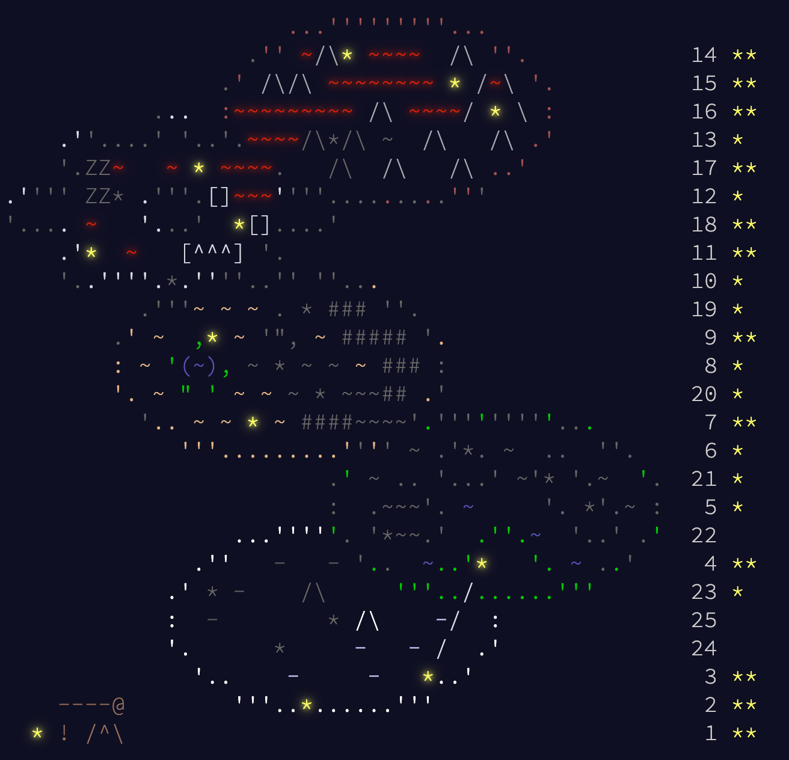

# AoC 2023
* [adventofcode.com/2023](https://adventofcode.com/2023)



---

## [Day 1: Trebuchet?!](https://adventofcode.com/2023/day/1)
* [🎨 YouTube ScreenShare 👀](https://www.youtube.com/watch?v=PWZwvm19qoQ)

```python
t1 = 0
t2 = 0
with open('input.txt') as input:
    m1 = {'1': 1, '2': 2, '3': 3, '4': 4, '5': 5, '6': 6, '7': 7, '8': 8, '9': 9}
    m2 = m1 | {'one': 1, 'two': 2, 'three': 3, 'four': 4, 'five': 5, 'six': 6, 'seven': 7, 'eight': 8, 'nine': 9}
    f = lambda m: [m[s[i:i + k]] for i in range(len(s)) for k in range(1, len(s) + 1 - i) if s[i:i + k] in m]
    for s in input:
        d1 = f(m1); t1 += int(f'{d1[0]}{d1[-1]}')
        d2 = f(m2); t2 += int(f'{d2[0]}{d2[-1]}')
print(f'part 1: {t1}')
print(f'part 2: {t2}')
# part 1: 55017
# part 2: 53539
```

---

## [Day 2: Cube Conundrum](https://adventofcode.com/2023/day/2)

* [🎨 YouTube ScreenShare 👀](https://www.youtube.com/watch?v=upnpeBNr7p0)

```python
from collections import Counter

def needs(subset):
    need = Counter()
    for group in subset.split(','):
        cnt, color = group.split()
        need[color] = int(cnt)
    return need

t1, t2 = 0, 0
with open('input.txt') as input:
    for line in input:
        game, values = line.split(':')
        num = int(game.split()[1])
        subsets, ok = values.split(';'), True
        r, g, b = 1, 1, 1
        for subset in subsets:
            need = needs(subset)
            ok = ok and need['red'] <= 12 and need['green'] <= 13 and need['blue'] <= 14
            r, g, b = max(r, need['red']), max(g, need['green']), max(b, need['blue'])
        t1 += num if ok else 0
        t2 += r * g * b

print(f'part 1: {t1}')
print(f'part 2: {t2}')
# part 1: 3059
# part 2: 65371
```

---

## [Day 3: Gear Ratios](https://adventofcode.com/2023/day/3)

* [🎨 YouTube ScreenShare 👀](https://www.youtube.com/watch?v=0c697p_l3_g)

```python
import copy, functools, operator

A = []
with open('input.txt') as input:
    for line in input:
        A.append(line.strip())
M, N, adj = len(A), len(A[0]), lambda i, j: [(u, v) for u, v in [(i - 1, j - 1), (i - 1, j), (i - 1, j + 1), (i, j + 1), (i + 1, j + 1), (i + 1, j), (i + 1, j - 1), (i, j - 1)] if 0 <= u < M and 0 <= v < N]

class Number:
    def __init__(self):
        self.val = 0; self.cells = set()
    ok = lambda self: any(not A[u][v].isdigit() and A[u][v] != '.' for i, j in self.cells for u, v in adj(i, j))

last, nums = Number(), []
for i in range(M):
    for j in range(N):
        if A[i][j].isdigit():
            last.val = 10 * last.val + int(A[i][j]); last.cells.add((i, j))
        else:
            nums.append(copy.deepcopy(last)); last = Number()
t1 = sum(num.val for num in nums if num.ok())

t2, gear = 0, [(i, j) for i in range(M) for j in range(N) if A[i][j] == '*']
for i, j in gear:
    take = set(num for u, v in adj(i, j) if A[u][v].isdigit() for num in nums if (u, v) in num.cells)
    if len(take) == 2:
        t2 += functools.reduce(operator.mul, [num.val for num in take])

print(f'part 1: {t1}')
print(f'part 2: {t2}')
# part 1: 539713
# part 2: 84159075
```

---

## [Day 4: Scratchcards](https://adventofcode.com/2023/day/4)

* [🎨 YouTube ScreenShare 👀](https://www.youtube.com/watch?v=PDMwycgQ9uo)

```python
from collections import Counter

t1 = 0
cnt, hi = Counter(), 0
with open('input.txt') as input:
    for line in input:
        L, R = line.strip().split('|')
        card = int([s for s in L.split(':')[0].split()][1]); cnt[card] += 1; hi = max(hi, card)
        need = set(int(s) for s in L.split(':')[1].split())
        have = set(int(s) for s in R.split())
        same = len(need & have)
        t1 += 1 << same - 1 if same else 0
        for i in range(same):
            take = card + i + 1
            cnt[take] += cnt[card]
t2 = sum(freq for card, freq in cnt.items() if card <= hi)

print(f'part 1: {t1}')
print(f'part 2: {t2}')
# part 1: 25571
# part 2: 8805731
```

---

## [Day 5: If You Give A Seed A Fertilizer](https://adventofcode.com/2023/day/5)

* [🎨 YouTube ScreenShare 👀](https://www.youtube.com/watch?v=kyng4JvDpXA)

```python
S1, S2 = [], []  # seeds for part 1 and part 2
soil = []
fert = []
water = []
light = []
temp = []
humid = []
place = []
A = None
with open('input.txt') as input:
    for line in input:
        line = line.strip()
        if not len(line):
            continue
        if line.startswith('seeds:'):
            _, values = line.split(':')
            for s in values.split():
                S1.append(int(s))
            for i in range(1, len(values), 2):
                S2.append((values[i - 1], values[i - 1] + values[i]))
        elif line.startswith('seed-to-soil map:'): A = soil
        elif line.startswith('soil-to-fertilizer map:'): A = fert
        elif line.startswith('fertilizer-to-water map:'): A = water
        elif line.startswith('water-to-light map:'): A = light
        elif line.startswith('light-to-temperature map:'): A = temp
        elif line.startswith('temperature-to-humidity map:'): A = humid
        elif line.startswith('humidity-to-location map:'): A = place
        else:
            dst, src, size = [int(s) for s in line.split()]
            offset = dst - src
            beg, end = src, src + size
            A.append((beg, end, offset))

def go(A, x):
    for beg, end, offset in A:
        if beg <= x < end:
            return x + offset
    return x

def f(x):
    x = go(soil, x)
    x = go(fert, x)
    x = go(water, x)
    x = go(light, x)
    x = go(temp, x)
    x = go(humid, x)
    x = go(place, x)
    return x

cand = [f(x) for x in S1]
best = min(cand)
print(f'part 1: {best}')
# part 1: 388071289

cand = [f(x) for x in range(beg, end) for beg, end in S2]
best = min(cand)
print(f'part 2: {best}')
# part 2: question -- how to find minimum in a reasonable amount of time?
# TODO: I think it's obvious, we must use overlapping intervals instead of trying hundreds of millions of different seeds!
```

---

## [Day 6: Wait For It](https://adventofcode.com/2023/day/6)

* [🎨 YouTube ScreenShare 👀](https://www.youtube.com/watch?v=51nP8lQuaL4)

```python
import operator
from functools import reduce

T, D = [], []  # time and distance
wins = []
with open('input.txt') as input:
    for time, dist in zip(input, input):
        for t in time.split(':')[1].split(): T.append(int(t))
        for d in dist.split(':')[1].split(): D.append(int(d))
    for t, d in zip(T, D):
        wins.append(len([x for x in range(1, t) if d < x * (t - x)]))
part1 = reduce(operator.mul, wins)

print(f'part 1: {part1}')
# part 1: 503424

# TODO: for part 2 we will try binary search to find the point where we start succeeding
# FFFFFFFTTTTTTTTTTTTFFFFFFFFF
# goal   ^   👈 use binary search to find this point which we use to derive the answer for part2
#        ^^^^^^^^^^^  symmetric bell curve for TRUE
```

---

## [Day 7: Camel Cards](https://adventofcode.com/2023/day/7)

```python
from functools import cmp_to_key
from collections import Counter, defaultdict

def kind(hand):
    cnt = Counter(hand).values()
    if 5 in cnt: return 'five of a kind'
    if 4 in cnt: return 'four of a kind'
    if 3 in cnt and 2 in cnt: return 'full house'
    if 3 in cnt: return 'three of a kind'
    if 2 in cnt:
        return 'one pair' if len([freq for freq in cnt if freq == 2]) == 1 else 'two pair'
    return 'high card'

def joke(hand):
    J = len([c for c in hand if c == 'J'])
    if kind(hand) == 'high card' and J: return 'one pair'
    if kind(hand) == 'one pair' and J: return 'three of a kind'
    if kind(hand) == 'two pair' and J: return 'full house' if J == 1 else 'four of a kind'
    if kind(hand) == 'three of a kind' and J: return 'four of a kind'
    if kind(hand) == 'full house' and J: return 'five of a kind'
    if kind(hand) == 'four of a kind' and J: return 'five of a kind'
    return kind(hand)

A = []
with open('input.txt') as input:
    for line in input:
        hand, bid = line.split()
        A.append((hand, int(bid)))
m1 = defaultdict(list)
m2 = defaultdict(list)
for hand, bid in A:
    m1[kind(hand)].append((hand, bid))
    m2[joke(hand)].append((hand, bid))

def compare(a, b, points):
    for x, y in zip(a[0], b[0]):
        if points[x] < points[y]: return -1
        if points[x] > points[y]: return 1
    return 0
comp1 = lambda a, b: compare(a, b, { str(i): i for i in range(2, 10) } | { 'T': 10, 'J': 11, 'Q': 12, 'K': 13, 'A': 14 })
comp2 = lambda a, b: compare(a, b, { str(i): i for i in range(2, 10) } | { 'T': 10, 'J':  1, 'Q': 12, 'K': 13, 'A': 14 })

order1 = []
order2 = []
for k in ['high card', 'one pair', 'two pair', 'three of a kind', 'full house', 'four of a kind', 'five of a kind']:
    for hand, bid in sorted(m1[k], key = cmp_to_key(comp1)): order1.append(bid)
    for hand, bid in sorted(m2[k], key = cmp_to_key(comp2)): order2.append(bid)
t1 = sum((i + 1) * bid for i, bid in enumerate(order1))
t2 = sum((i + 1) * bid for i, bid in enumerate(order2))
print(f'part 1: {t1}')
print(f'part 2: {t2}')
# part 1: 248113761
# part 2: 246285222
```

---

## [Day 8: Haunted Wasteland](https://adventofcode.com/2023/day/8)

* [🎨 YouTube ScreenShare 👀](https://www.youtube.com/watch?v=_193UASlqAs)

```python
class Node:
    def __init__(self, name, L = None, R = None):
        self.name = name
        self.L = L
        self.R = R

dirs, nodes = [], {}
with open('input.txt') as input:
    first = True
    for line in input:
        line = ''.join([c for c in line if not c.isspace() and c != '(' and c != ')'])
        if first:
            dirs = line; first = False
        elif len(line):
            P, kids = line.split('=')  # parent, left/right kids
            L, R = kids.split(',')
            if P not in nodes: nodes[P] = Node(P)
            if L not in nodes: nodes[L] = Node(L)
            if R not in nodes: nodes[R] = Node(R)
            nodes[P].L = nodes[L]
            nodes[P].R = nodes[R]

step, node = 0, nodes['AAA']
while node.name != 'ZZZ':
    i = step % len(dirs); step += 1
    if dirs[i] == 'L': node = node.L
    if dirs[i] == 'R': node = node.R
print(f'part 1: {step}')
# part 1: 13301

step, pre = 0, [node for name, node in nodes.items() if name[-1] == 'A']
while not all(node.name[-1] == 'Z' for node in pre):
    i = step % len(dirs); step += 1; cur = []
    if not (step % len(dirs)):
        print(f'step {step}: A: {[node.name for node in pre]}')
    for node in pre:
        if dirs[i] == 'L': cur.append(node.L)
        if dirs[i] == 'R': cur.append(node.R)
    pre = cur
print(f'part 2: {step}')
# TODO: this step is taking forever to run, maybe look for alternative patterns such as pisano period to derive a solution?
```

---

## [Day 9: Mirage Maintenance](https://adventofcode.com/2023/day/9)

```python
from collections import deque

t1 = 0
t2 = 0
with open('input.txt') as input:
    for line in input:
        A = [deque([int(s) for s in line.split()])]
        while not all([not x for x in A[-1]]):
            A.append(deque([A[-1][i] - A[-1][i - 1] for i in range(1, len(A[-1]))]))
        for i in reversed(range(len(A) - 1)):
            A[i].appendleft(A[i][0] - A[i + 1][0])
        t1 += sum(row[-1] for row in A)
        t2 += A[0][0]

print(f'part 1: {t1}')
print(f'part 2: {t2}')
# part 1: 1955513104
# part 2: 1131
```

---

## [Day 10: Pipe Maze](https://adventofcode.com/2023/day/10)

* [🎨 YouTube ScreenShare 👀](https://www.youtube.com/watch?v=vB5bligWD5k)

```python
from collections import deque

A = []
with open('input.txt') as input:
    for line in input:
        A.append(line.strip())
M, N = len(A), len(A[0])

# .....
# .F-7.
# .|.|.
# .L-J.
# .....
U = set(['F','|','7'])  # up
R = set(['7','-','J'])  # right
D = set(['L','|','J'])  # down
L = set(['L','-','F'])  # left

q, seen, depth = deque([(i, j) for i in range(M) for j in range(N) if A[i][j] == 'S']), set(), 0
while q:
    ok = False
    for _ in range(len(q)):
        i, j = q.popleft()
        if (i, j) in seen:
            continue
        seen.add((i, j))
        for u, v in [(i - 1, j), (i, j + 1), (i + 1, j), (i, j - 1)]:
            if u < 0 or v < 0 or u == M or v == N or (u, v) in seen:
                continue
            du, dv = u - i, v - j
            a = du == -1 and dv ==  0 and (A[i][j] in D or A[i][j] == 'S') and A[u][v] in U
            b = du ==  0 and dv ==  1 and (A[i][j] in L or A[i][j] == 'S') and A[u][v] in R
            c = du ==  1 and dv ==  0 and (A[i][j] in U or A[i][j] == 'S') and A[u][v] in D
            d = du ==  0 and dv == -1 and (A[i][j] in R or A[i][j] == 'S') and A[u][v] in L
            if a | b | c | d:
                q.append((u, v)); ok = True
    depth += int(ok)

print(f'part 1: {depth}')
# part 1: 7173
```

---

## [Day 11: Cosmic Expansion](https://adventofcode.com/2023/day/11)

* [🎨 YouTube ScreenShare 👀](https://www.youtube.com/watch?v=3agu03IKynM)

```python
A = []
with open('input.txt') as input:
    for line in input:
        A.append(line.strip())
M, N = len(A), len(A[0])

row, col = [], []
V = set((i, j) for i in range(M) for j in range(N) if A[i][j] == '#')
for u in V:
    for v in V:
        di = 1 if u[0] < v[0] else -1 if v[0] < u[0] else 0
        dj = 1 if u[1] < v[1] else -1 if v[1] < u[1] else 0
        i, j = u
        while i != v[0] or j != v[1]:
            if i != v[0]: i += di; row.append(i)
            if j != v[1]: j += dj; col.append(j)

cost1 = int(2e0)
cost2 = int(1e6)
SPACE_ROW = set(i for i in range(M) if all(c == '.' for j in range(N) for c in A[i][j]))
SPACE_COL = set(j for j in range(N) if all(c == '.' for i in range(M) for c in A[i][j]))
t1 = sum(cost1 if i in SPACE_ROW else 1 for i in row) + sum(cost1 if j in SPACE_COL else 1 for j in col)
t2 = sum(cost2 if i in SPACE_ROW else 1 for i in row) + sum(cost2 if j in SPACE_COL else 1 for j in col)
print(f'part 1: {t1 // 2}')
print(f'part 2: {t2 // 2}')
# part 1: 9608724
# part 2: 904633799472
```

---

## [Day 12: Hot Springs](https://adventofcode.com/2023/day/12)

* [🎨 YouTube ScreenShare 👀](https://www.youtube.com/watch?v=J68sq712ArE)

```python
A = []
with open('input.txt') as input:
    for line in input:
        S, T = line.split()  # String, Target
        S = [c if c != '.' else ' ' for c in S]
        T = [int(x) for x in T.split(',')]
        A.append((S, T))

def go(S, T, i = 0, t = 0):
    if i == len(S):
        return [len(it) for it in ''.join(S).split()] == T
    if S[i] != '?':
        return go(S, T, i + 1)
    last = S[i]
    for next in ['#', ' ']:
        S[i] = next
        t += go(S, T, i + 1)
    S[i] = last
    return t

t1 = sum(go(S, T) for S, T in A)
print(f'part 1: {t1}')
# part 1: 8180
```

---

## [Day 13: Point of Incidence](https://adventofcode.com/2023/day/13)

* [🎨 YouTube ScreenShare 👀](https://www.youtube.com/watch?v=aEoqzSa_eQE)

```python
matrix = []
with open('input.txt') as input:
    A = []
    for line in input:
        if line == '\n':
            matrix.append(A[:]); A = []
        else:
            A.append(list(line.strip()))
if len(A):
    matrix.append(A[:])

def row(A):
    M = len(A)
    for i in range(1, M):
        u = i - 1  # 👍 up
        d = i      # 👎 down
        while 0 <= u and d < M and A[u] == A[d]:
            u -= 1
            d += 1
        if u == -1 or d == M:
            return i
    return 0

rotate = lambda A: [[A[i][j] for i in range(len(A))] for j in range(len(A[0]))][::-1]  # rotate 90 degrees counterclockwise == reversed(transposed(A))
def col(A):
    N = len(A[0])
    j = row(rotate(A))
    return N - j if j else 0

rows1 = sum(row(A) for A in matrix)
cols1 = sum(col(A) for A in matrix)

print(f'part 1: {100 * rows1 + cols1}')
# part 1: 32371
```

---

## [Day 14: Parabolic Reflector Dish](https://adventofcode.com/2023/day/14)

```python
A = []
with open('input.txt') as input:
    for line in input:
        A.append([c for c in line.strip()])
M, N = len(A), len(A[0])

total = lambda A: sum(M - i for i in range(M) for j in range(N) if A[i][j] == 'O')

def step(i, j, di, dj):
    if A[i][j] != 'O':
        return
    u, v = i + di, j + dj
    while 0 <= u < M and 0 <= v < N and A[u][v] == '.':
        A[i][j] = '.'; A[u][v] = 'O'
        i, j = u, v; u, v = i + di, j + dj

def north(A):
    for i in range(M):
        for j in range(N):
            step(i, j, di=-1, dj=0)
    return total(A)

def cycle(A):
    for _ in range(1000):
        for di, dj in [(-1, 0), (0, -1), (1, 0), (0, 1)]:
            for i in range(M) if di == -1 else reversed(range(M)):
                for j in range(N) if dj == -1 else reversed(range(N)):
                    step(i, j, di, dj)
    return total(A)

print(f'part 1: {north(A[:])}')
print(f'part 2: {cycle(A[:])}')
# part 1: 109424
# part 2: 102509
```

---

## [Day 15: Lens Library](https://adventofcode.com/2023/day/15)

```python
from functools import reduce

A = []
with open('input.txt') as input:
    for line in input:
        A = line.strip().split(',')

f = lambda s: reduce(lambda t, c: (t + ord(c)) * 17 % 256, s, 0)

box = [[] for _ in range(256)]
for s in A:
    if s.endswith('-'):
        k = s[:-1]
        i = f(k)
        box[i] = [(key, val) for key, val in box[i] if key != k]
    else:
        k, v = s.split('='); v = int(v)
        i = f(k)
        found = False
        for j, (key, val) in enumerate(box[i]):
            if key == k:
                box[i][j] = (k, v); found = True
        if not found:
            box[i].append((k, v))

t1 = sum(f(s) for s in A)
t2 = sum((i + 1) * (j + 1) * box[i][j][1] for i in range(len(box)) for j in range(len(box[i])))
print(f'part 1: {t1}')
print(f'part 2: {t2}')
# part 1: 514281
# part 2: 244199
```

---

## [Day 16: The Floor Will Be Lava](https://adventofcode.com/2023/day/16)

```python
from collections import deque

A = []
with open('input.txt') as input:
    for line in input:
        A.append(line.strip())
M, N = len(A), len(A[0])

def run(start, seen):
    q = deque()
    def enqueue(step):
        i, j, _, _ = step
        if step not in seen and 0 <= i < M and 0 <= j < N:
            q.append(step); seen.add(step)
    enqueue(start)
    while q:
        i, j, di, dj = q.popleft()
        step = (i + di, j + dj, di, dj)
        U = (i - 1, j, -1, 0)  # up
        D = (i + 1, j,  1, 0)  # down
        L = (i, j - 1, 0, -1)  # left
        R = (i, j + 1, 0,  1)  # right
        if A[i][j] == '.':
            enqueue(step)
        elif A[i][j] == '|':
            if di: enqueue(step)
            if dj: enqueue(U); enqueue(D)
        elif A[i][j] == '-':
            if di: enqueue(L); enqueue(R)
            if dj: enqueue(step)
        elif A[i][j] == '/':
            if di == -1: enqueue(R)  # up -> right
            if di ==  1: enqueue(L)  # down -> left
            if dj == -1: enqueue(D)  # left -> down
            if dj ==  1: enqueue(U)  # right -> up
        elif A[i][j] == '\\':
            if di == -1: enqueue(L)  # up -> left
            if di ==  1: enqueue(R)  # down -> right
            if dj == -1: enqueue(U)  # left -> up
            if dj ==  1: enqueue(D)  # right -> down
    return len(set([(i, j) for i, j, _, _ in seen]))

start1 = (0, 0, 0, 1)  # i,j  di,dj
U = [(0, j, 1, 0) for j in range(N)]     # up-most row
D = [(M-1, j, -1, 0) for j in range(N)]  # down-most row
L  = [(i, 0, 1, 0) for i in range(M)]    # left-most column
R = [(i, N-1, -1, 0) for i in range(M)]  # right-most column
start2 = U + D + L + R
t1 = run(start1, seen=set())
t2 = max(run(cand, seen=set()) for cand in start2)
print(f'part 1: {t1}')
print(f'part 2: {t2}')
# part 1: 7060
# part 2: 7493
```

---

## [Day 17: Clumsy Crucible](https://adventofcode.com/2023/day/17)

```python
from heapq import heappop, heappush

A = []
with open('input.txt') as input:
    for line in input:
        A.append([int(x) for x in line.strip()])
M, N = len(A), len(A[0])

def run(lo, hi):
    def enqueue(dist, i, j, du, dv, step):
        u = i + du
        v = j + dv
        if 0 <= u < M and 0 <= v < N:
            heappush(q, (dist + A[u][v], u, v, du, dv, step))
    q, seen = [(0, 0, 0, 0, 0, 0)], set()  # dist, i, j, di, dj, step
    while q:
        dist, i, j, di, dj, step = heappop(q)
        if lo <= step and i == M - 1 and j == N - 1:                # 🎯 target: 🚫 lo step minimum constraint
            return dist
        if (i, j, di, dj, step) in seen:
            continue
        seen.add((i, j, di, dj, step))
        if step < hi and (di, dj) != (0, 0):                        # same direction (di, dj): 🚫 hi step maximum contraint
            enqueue(dist, i, j, di, dj, step + 1)
        if lo <= step or (di, dj) == (0, 0):
            for du, dv in [(-1, 0), (0, 1), (1, 0), (0, -1)]:       # diff direction (du, dv): 🌱 first step
                if (du, dv) != (di, dj) and (du, dv) != (-di, -dj):
                    enqueue(dist, i, j, du, dv, step=1)

print(f'part 1: {run(1, 3)}')
print(f'part 2: {run(4, 10)}')
# part 1: 635
# part 2: 734
```

---

## [Day 18: Lavaduct Lagoon](https://adventofcode.com/2023/day/18)

```python
# https://en.wikipedia.org/wiki/Shoelace_formula
segments = lambda V: zip(V, V[1:] + [V[0]])
shoelace = lambda V: abs(sum((x1 * y2) - (x2 * y1) for ((x1, y1), (x2, y2)) in segments(V))) // 2

def run(part1=True):
    i, j = 0, 0
    V, P = [(i, j)], 0  # Vertices, Perimeter
    with open('input.txt') as input:
        for line in input:
            d, step, color = line.split(); step = int(step)
            if not part1:
                step, last = int(color[2:-2], 16), int(color[-2])
                d = 'R' if last == 0 else 'D' if last == 1 else 'L' if last == 2 else 'U'
            di, dj = (-1, 0) if d == 'U' else (1, 0) if d == 'D' else (0, -1) if d == 'L' else (0, 1)
            i += di * step
            j += dj * step
            V.append((i, j)); P += step
    return shoelace(V) + (P // 2) + 1  # half of P because half of the perimeter is already included in the shoelace area

print(f'part 1: {run(True)}')
print(f'part 2: {run(False)}')
# part 1: 47045
# part 2: 147839570293376
```

---

## [Day 19: Aplenty](https://adventofcode.com/2023/day/19)

```python
workflow, xmas = {'A':'A', 'R':'R'}, []
with open('input.txt') as input:
    for line in input:
        line = line.strip()
        if not len(line):
            continue
        if line[0] == '{':
            vals = [int(pair.split('=')[1]) for pair in line[1:-1].split(',')]  # line[1:-1] to exclude prefix and suffix as '{' and '}' correspondingly
            xmas.append(vals)
        else:
            line = line.replace('{', ' ')
            line = line.replace('}', ' ')
            name, rules = line.split()
            workflow[name] = rules.split(',')

A, R = [], []
for vals in xmas:
    name, done = 'in', False
    while not done:
        for rule in workflow[name]:
            if   rule == 'A': A.append(vals); done = True
            elif rule == 'R': R.append(vals); done = True
            elif rule in workflow: name = rule; break
            else:
                pred, dest = rule.split(':')  # predicate, destination workflow name
                c, op, val = pred[0], pred[1], int(pred[2:])
                i = 'xmas'.index(c)
                if op == '<' and vals[i] < val: name = dest; break
                if op == '>' and vals[i] > val: name = dest; break
t1 = sum(sum(row) for row in A)
print(f'part 1: {t1}')
# part 1: 476889
```

---

## [Day 20: Pulse Propagation](https://adventofcode.com/2023/day/20)

```python
from collections import Counter, deque
class Module:
    def __init__(self, name, kind, kids):
        self.name = name
        self.kind = kind
        self.parents, self.kids = {}, kids
        self.state = 0                                # 0 == off  and  1 == on

    def process(self, val, last, next_val = -123):
        if self.kind == '*':                          # 📢 broadcast module
            next_val = val
        if self.kind == '%' and not val:              # 🩴 flip-flop module (🚫 ignore high-pulse, ie. val == 1) 🙃 flip on/off state 👍👎
            next_val = self.state = self.state ^ 1
        if self.kind == '&':                          # 🌈 conjunction module
            self.parents[last] = val
            next_val = int(not all(self.parents.values()))
        return [(kid, next_val, self.name) for kid in self.kids] if next_val != -123 else None

m = {}
with open('input.txt') as input:
    for line in input:
        L, R = line.strip().split(' -> ')
        kind, name = (L[0], L[1:]) if L != 'broadcaster' else ('*', 'broadcaster')
        kids = R.split(', ')
        m[name] = Module(name, kind, kids)
    for name in m.keys():
        for kid in m[name].kids:
            if kid in m:
                m[kid].parents[name] = 0

cnt = Counter()
for _ in range(1000):
    q = deque([('broadcaster', 0, 'Make it so! Engage! 🚀')])  # to name, pulse value, from last name
    while q:
        name, val, last = q.popleft(); cnt[val] += 1
        next = m[name].process(val, last) if name in m else None
        if next:
            q.extend(next)
print(f'part 1: {cnt[0] * cnt[1]}')
# part 1: 1020211150
```

---

## [Day 21: Step Counter](https://adventofcode.com/2023/day/21)

```python
from collections import deque

A = []
with open('input.txt') as input:
    for line in input:
        A.append(line.strip())
M, N = len(A), len(A[0])

def run(steps):
    S = [(i, j) for i in range(M) for j in range(N) if A[i][j] == 'S'][0]
    q, step = deque([S]), 0; seen = set(q)
    while q and step <= steps:
        next = []
        for _ in range(len(q)):
            i, j = q.popleft()
            for u, v in [(i - 1, j), (i, j + 1), (i + 1, j), (i, j - 1)]:
                if 0 <= u < M and 0 <= v < N and (u, v) not in seen and (A[u][v] == '.' or A[u][v] == 'S'):
                    next.append((u, v)); seen.add((u, v))
        q.extend(next); step += 1
    ok = lambda i, j: steps & 1 == abs(i - S[0]) + abs(j - S[1]) & 1    # steps and cell i,j distance to origin are both even inclusive-or both odd, ie. we can step back-and-forth an even amount of times: distances of 0,2,4,6,etc from origin for even steps from origin and distances of 1,3,5,7,etc from origin for odd steps from origin
    return len([(i, j) for i, j in seen if ok(i, j)])
print(f'part 1: {run(64)}')
# part 1: 3740
```

---

## [Day 23: A Long Walk](https://adventofcode.com/2023/day/23)

```python
import sys
sys.setrecursionlimit(int(1e5))

A = []
with open('input.txt') as input:
    for line in input:
        A.append(line.strip())
M, N = len(A), len(A[0])

S = (0, [j for j in range(N) if A[0][j] == '.'][0])
T = (M - 1, [j for j in range(N) if A[M - 1][j] == '.'][0])

seen = set()
def go(i = S[0], j = S[1]):
    if i < 0 or j < 0 or i == M or j == N or A[i][j] == '#' or (i, j) in seen or (i, j) == T:
        return 0
    best = 0
    seen.add((i, j))
    if   A[i][j] == '^': best = go(i - 1, j)
    elif A[i][j] == '>': best = go(i, j + 1)
    elif A[i][j] == 'v': best = go(i + 1, j)
    elif A[i][j] == '<': best = go(i, j - 1)
    else: best = max(go(u, v) for u, v in [(i - 1, j), (i, j + 1), (i + 1, j), (i, j - 1)])
    seen.remove((i, j))
    return 1 + best
print(f'part 1: {go()}')
# part 1: 2254
```
